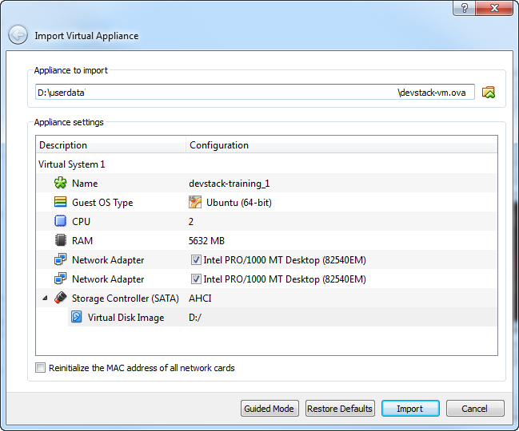

[image] (https://s3.eu-central-1.amazonaws.com/openstack-training/devstack-vm.ova)
Help to import the VirtualBox [pre-built image][image]
======================================================
Windows
-------
This guide helps you to import the VirtualBox [pre-built image][image] on a Windows machine even if you would like to use other drive than C:\.

1. Open VirtualBox Manager
2. `File` -> `Import appliance...` (Crtl-I)
3. Select the downloaded [pre-built image][image]
4. By double click on any Configuration parameter you can change them, including the location of the Virtual Disk Image

5. Import
